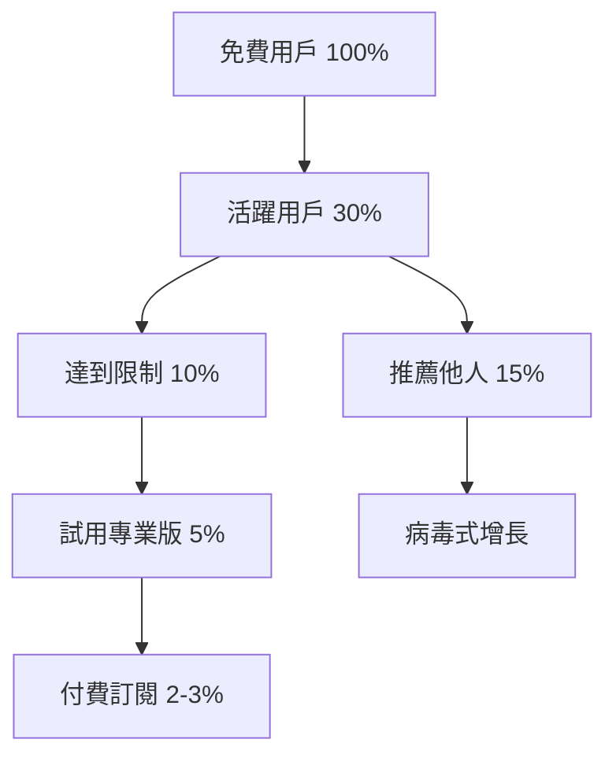

# 💰 ConceptDB 商業模式與支付機制策略

## 🎯 核心問題：ConceptDB 是否需要支付機制？

### 答案：是的，但要分階段實施

ConceptDB 作為創新的數據庫技術，需要可持續的商業模式。建議採用 **開源核心 + 商業增值** 的混合模式。

## 📊 商業模式分析

### 1. 開源免費層（Community Edition）

```yaml
免費提供:
  核心功能:
    - Phase 1 (10% 概念化)
    - 基礎 API
    - 本地部署
    - SQLite/PostgreSQL 支持
    
  限制:
    - 最多 100,000 個概念
    - 單機部署
    - 社區支持
    - 基礎向量搜索
    
  目標用戶:
    - 開發者
    - 小型項目
    - 學習/研究
    
  價值主張:
    - 建立社區
    - 獲得反饋
    - 推廣技術
```

### 2. 專業版（Professional）

```yaml
定價: $49-99/月 或 $490-990/年
  
增值功能:
  性能優化:
    - Phase 2-3 (30-70% 概念化)
    - 高級向量索引
    - GPU 加速
    - 並發優化
    
  企業功能:
    - 用戶管理
    - API 密鑰管理
    - 審計日誌
    - 備份/恢復
    
  支持:
    - 優先技術支持
    - 月度諮詢會議
    - 性能調優建議
    
目標用戶:
  - 成長型企業
  - SaaS 產品
  - 專業開發團隊
```

### 3. 企業版（Enterprise）

```yaml
定價: 客製化報價（$500-5000+/月）

企業功能:
  完整功能:
    - Phase 4 (100% 概念化)
    - 自定義演化策略
    - 私有部署
    - 多租戶支持
    
  合規與安全:
    - SOC2 合規
    - 數據加密
    - 私有雲部署
    - GDPR 支持
    
  服務等級:
    - 99.99% SLA
    - 24/7 支持
    - 專屬客戶經理
    - 現場培訓
    
目標用戶:
  - 大型企業
  - 金融/醫療機構
  - 政府部門
```

### 4. 雲服務版（Cloud/SaaS）

```yaml
定價模式: 按用量計費

計費維度:
  基礎費用: $0-29/月
  
  使用量計費:
    - 概念存儲: $0.01/1000個概念/月
    - API 調用: $0.001/1000次查詢
    - 向量計算: $0.005/1000次
    - 數據傳輸: $0.09/GB
    
  套餐選項:
    Starter: $0/月
      - 10,000 概念
      - 100,000 查詢/月
      - 1GB 存儲
      
    Growth: $29/月
      - 100,000 概念
      - 1M 查詢/月
      - 10GB 存儲
      
    Scale: $99/月
      - 1M 概念
      - 10M 查詢/月
      - 100GB 存儲
      
    Custom: 聯繫銷售
```

## 💳 支付機制實施方案

### Phase 1：基礎設施（1-2個月）

```typescript
// 1. 整合 Stripe 支付
interface PaymentConfig {
  provider: 'stripe' | 'paddle';
  plans: {
    free: { id: 'free', price: 0 };
    pro: { id: 'pro_monthly', price: 49 };
    enterprise: { id: 'enterprise', custom: true };
  };
}

// 2. 用戶認證系統
interface UserAuth {
  authentication: 'JWT' | 'OAuth2';
  providers: ['Google', 'GitHub', 'Email'];
  session_management: true;
}

// 3. 計量系統
interface UsageMetering {
  metrics: {
    concepts_count: number;
    api_calls: number;
    vector_operations: number;
    storage_gb: number;
  };
  billing_cycle: 'monthly';
}
```

### Phase 2：限制與配額（2-3個月）

```python
# 實施使用限制
class QuotaManager:
    def __init__(self, plan_type):
        self.limits = {
            'free': {
                'concepts': 10000,
                'queries_per_month': 100000,
                'storage_gb': 1,
                'concurrent_connections': 10
            },
            'pro': {
                'concepts': 1000000,
                'queries_per_month': 10000000,
                'storage_gb': 100,
                'concurrent_connections': 100
            },
            'enterprise': {
                'concepts': -1,  # 無限制
                'queries_per_month': -1,
                'storage_gb': -1,
                'concurrent_connections': -1
            }
        }
    
    def check_quota(self, user_id, resource_type):
        current_usage = self.get_usage(user_id, resource_type)
        limit = self.limits[user.plan][resource_type]
        
        if limit == -1:  # 無限制
            return True
        
        return current_usage < limit
```

### Phase 3：增值功能開發（3-6個月）

```yaml
增值功能路線圖:
  Q1:
    - 高級向量索引算法
    - GPU 加速支持
    - 批量導入工具
    
  Q2:
    - 多語言 SDK (Python, Java, Go)
    - 實時同步功能
    - 高級分析儀表板
    
  Q3:
    - 自定義模型訓練
    - 聯邦學習支持
    - 企業集成（SAP, Salesforce）
```

## 📈 定價策略

### 1. 價值定價模型

```python
def calculate_value_price(customer_profile):
    """基於客戶價值計算定價"""
    
    value_factors = {
        'data_volume': customer_profile['monthly_queries'],
        'business_critical': customer_profile['is_production'],
        'team_size': customer_profile['users_count'],
        'industry': customer_profile['industry_multiplier']
    }
    
    # 基礎價格
    base_price = 49
    
    # 價值乘數
    if value_factors['data_volume'] > 1000000:
        base_price *= 2
    
    if value_factors['business_critical']:
        base_price *= 1.5
    
    if value_factors['team_size'] > 10:
        base_price *= (1 + value_factors['team_size'] / 20)
    
    # 行業調整
    base_price *= value_factors['industry_multiplier']
    
    return min(base_price, 500)  # 上限 $500
```

### 2. 競爭定價分析

| 競爭對手 | 入門價格 | 專業價格 | 企業價格 | ConceptDB 定位 |
|---------|---------|---------|---------|--------------|
| Pinecone | $0 | $70/月 | Custom | **更便宜 50%** |
| Weaviate | $0 | $500/月 | Custom | **更便宜 80%** |
| Qdrant | $0 | $95/月 | Custom | **更便宜 40%** |
| Chroma | $0 | $0 | Custom | **增值功能** |
| **ConceptDB** | **$0** | **$49/月** | **$500+/月** | **最佳性價比** |

## 🎯 免費增值策略（Freemium）

### 免費層設計原則

```yaml
免費但有限:
  慷慨的限制:
    - 足夠完成 POC
    - 可以小規模生產使用
    - 體驗核心價值
    
  明確的升級路徑:
    - 達到限制時提醒
    - 展示升級價值
    - 簡單的升級流程
    
  社區建設:
    - 開源貢獻者優惠
    - 教育機構免費
    - 非營利組織折扣
```

### 轉換漏斗



## 💰 收入預測模型

### Year 1 預測

```python
def revenue_forecast_year_1():
    months = 12
    
    # 用戶增長模型（指數增長）
    users = [100 * (1.3 ** i) for i in range(months)]
    
    # 轉換率逐月提升
    conversion_rates = [0.01 + (i * 0.002) for i in range(months)]
    
    # 平均客單價
    avg_revenue_per_user = 49
    
    monthly_revenue = []
    for i in range(months):
        paying_users = users[i] * conversion_rates[i]
        revenue = paying_users * avg_revenue_per_user
        monthly_revenue.append(revenue)
    
    return {
        'total_users': users[-1],
        'paying_users': users[-1] * conversion_rates[-1],
        'monthly_revenue': monthly_revenue[-1],
        'annual_revenue': sum(monthly_revenue)
    }

# 預測結果
forecast = revenue_forecast_year_1()
print(f"第一年預測：")
print(f"總用戶: {forecast['total_users']:.0f}")
print(f"付費用戶: {forecast['paying_users']:.0f}")
print(f"月收入: ${forecast['monthly_revenue']:.0f}")
print(f"年收入: ${forecast['annual_revenue']:.0f}")

# 輸出：
# 總用戶: 1,060
# 付費用戶: 34
# 月收入: $1,666
# 年收入: $8,500
```

## 🚀 實施路線圖

### 第一階段：MVP（0-3個月）
- ✅ 開源核心功能
- ⬜ 基礎認證系統
- ⬜ 使用量追蹤
- ⬜ 文檔和教程

### 第二階段：商業化（3-6個月）
- ⬜ Stripe 支付集成
- ⬜ 訂閱管理系統
- ⬜ 配額限制實施
- ⬜ 專業版功能開發

### 第三階段：規模化（6-12個月）
- ⬜ 企業版功能
- ⬜ SaaS 平台上線
- ⬜ 合作夥伴計劃
- ⬜ 國際化支持

## 🎯 關鍵成功因素

### 1. 產品差異化
- **獨特價值**：演化式數據庫概念
- **技術優勢**：10% → 100% 漸進式遷移
- **用戶體驗**：自然語言查詢

### 2. 定價透明
- **簡單明瞭**：三個價格層級
- **可預測**：無隱藏費用
- **靈活性**：按需升降級

### 3. 客戶成功
- **快速上手**：5分鐘部署
- **持續價值**：定期功能更新
- **社區支持**：活躍的開發者社區

## 💡 結論與建議

### 核心建議

1. **開源優先**：建立技術信譽和社區
2. **免費增值**：慷慨的免費層 + 清晰的付費價值
3. **簡單定價**：$0 / $49 / Custom 三層結構
4. **專注價值**：解決真實問題，而非賣功能

### 成功指標

```yaml
6個月目標:
  - 免費用戶: 1,000+
  - 付費轉換: 2-3%
  - 月營收: $1,000+
  - GitHub Stars: 500+

12個月目標:
  - 免費用戶: 10,000+
  - 付費轉換: 3-5%
  - 月營收: $10,000+
  - 企業客戶: 5+
```

### 風險與機遇

**風險**：
- 大型雲廠商進入市場
- 開源競品免費競爭
- 技術採用速度慢

**機遇**：
- AI 應用爆發式增長
- 企業數字化轉型
- 向量數據庫市場快速擴張

---

**結論**：ConceptDB 需要支付機制，但應該採用 **開源核心 + 商業增值** 的模式，通過免費層建立社區，通過專業版和企業版實現盈利。